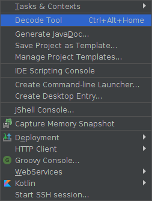
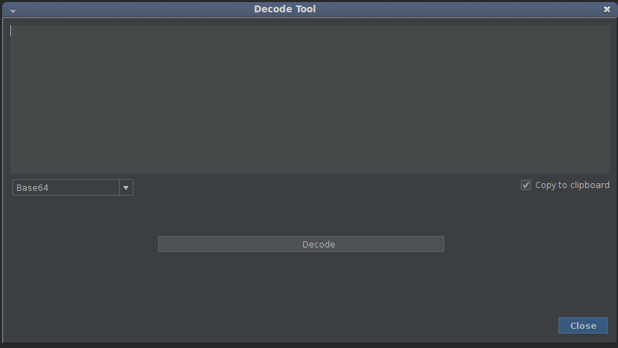
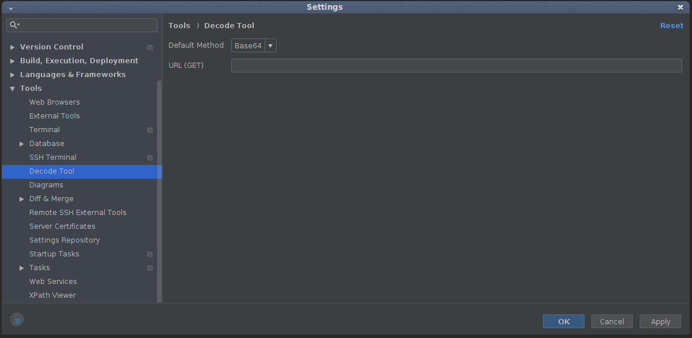

# decode-tool-plugin-intellij
Plugin for intellij IDEA to decode base64, Gzip and Http request method

# How to install

- Download decode-tool-plugin-intellij.jar from root.
- Open IntellijIDEA -> File -> Settings -> Plugins, install plugin from disk, select jar and restart Intellij 

# How to Use

- Open Decode popup from Tool Menu

- Select Decode method Base64, Gzip, Url (Need Configuration)

- Click Decode, the result is automatically copied to clipboard.

# Settings

- File -> Settings -> Tools -> DecodeTool

- Default Method when popup shows

- URL GET to request a token by path to a decode resource
